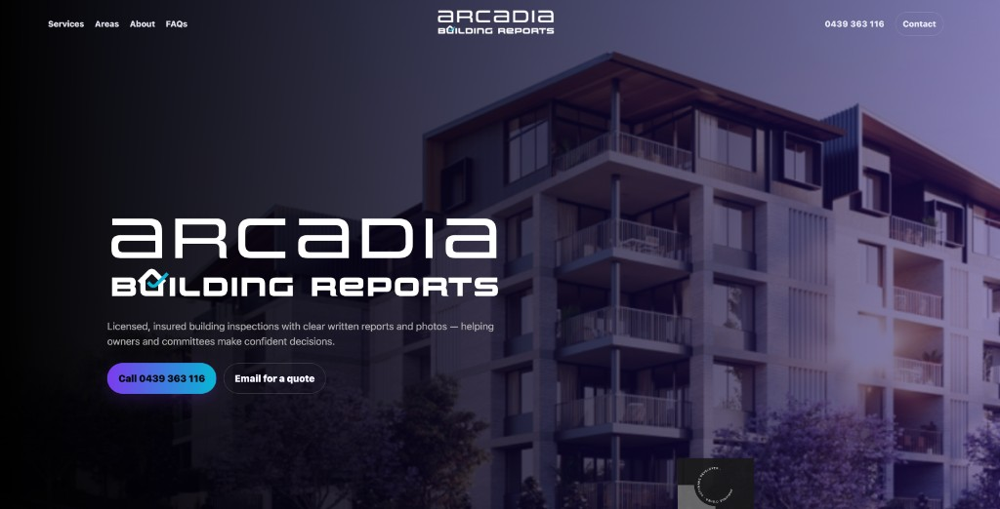
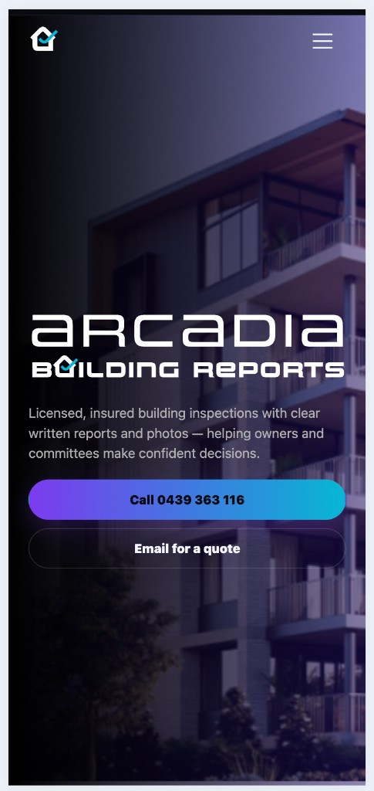
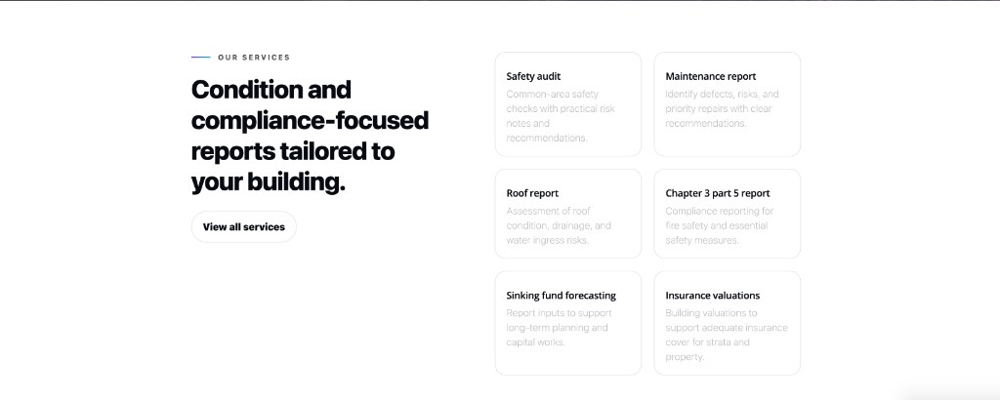

# Arcadia Building Reports — Website

Marketing site for **Arcadia Building Reports**, a licensed building inspection practice serving **Brisbane and South East Queensland**. The site explains services (safety audits, maintenance and roof reports, Chapter 3 part 5, sinking fund forecasting, insurance valuations, and more), service areas, FAQs, and how to get in touch. It is aimed at **strata committees, property managers, and owners** who need clear, photo-supported written reports for confident decisions.

Live site (canonical): [arcadiabuildingreports.com.au](https://www.arcadiabuildingreports.com.au/)

## Tech stack

| Layer           | Technology                                                                                                                  |
| --------------- | --------------------------------------------------------------------------------------------------------------------------- |
| Pages           | Static HTML (`index.html`, `services.html`, `areas.html`, `about.html`, `faq.html`, `contact.html`)                         |
| Styling         | Custom CSS in `styles.css` (layout, responsive breakpoints, hero treatments, components)                                    |
| Scripting       | Vanilla JavaScript in `main.js` (mobile navigation, scroll behaviour, homepage hero intro, footer year, in-view animations) |
| Typography      | [Google Fonts](https://fonts.google.com/) — Open Sans                                                                       |
| Forms           | `contact.html` posts to `contact.php` for server-side handling and email delivery (typical cPanel / PHP hosting)            |
| SEO / discovery | `sitemap.xml`, `robots.txt`, meta and Open Graph tags on pages                                                              |

There is **no** React, Vue, or Tailwind in this repository — it is a hand-built static front end plus a small PHP handler for the contact form.

## Screenshots

### Home — desktop



### Home — mobile



### Services



Source captures are also kept under your Cursor project `assets` folder if you need originals with timestamped filenames.

## Local preview

Open `index.html` in a browser, or serve the folder with any static file server, for example:

```bash
python3 -m http.server 8080
```

Then visit `http://localhost:8080/`. Contact form submission requires a host that runs PHP and is configured for `contact.php` (not available from a pure static preview unless you stub or proxy the endpoint).

## Project layout (high level)

- `index.html` — Home / hero, key messaging, CTAs (call and email).
- `services.html`, `areas.html`, `about.html`, `faq.html` — Supporting pages linked from the header.
- `contact.html` + `contact.php` — Quote / enquiry flow.
- `images/` — Logos, photography, and SVG assets referenced by the pages.
